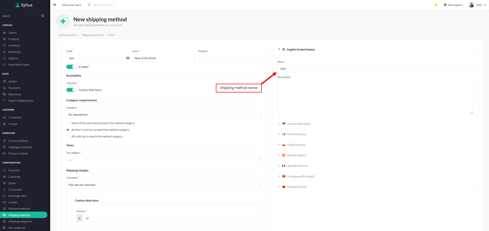
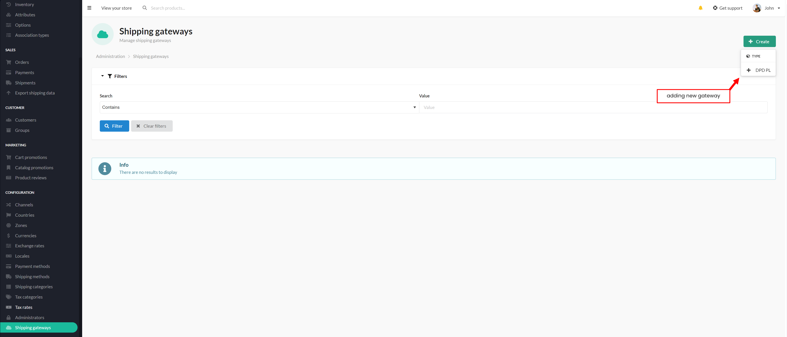
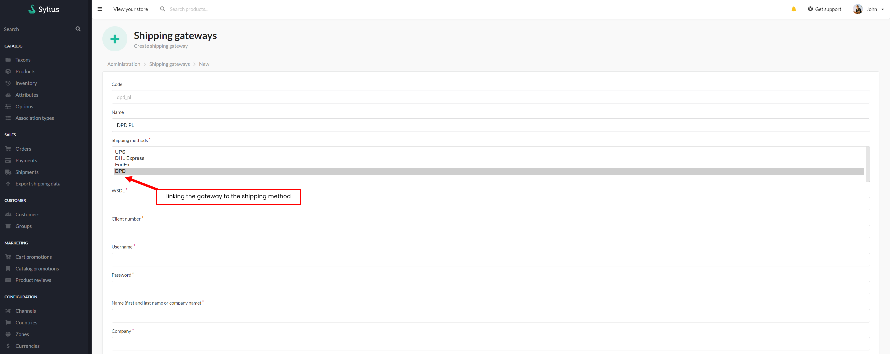
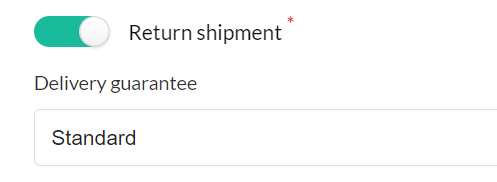
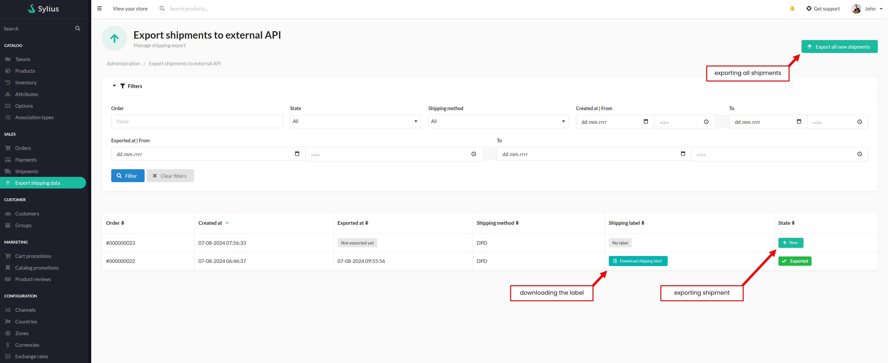

# Functionalities

---
### Introduction

---
DPD Poland is part of Geopost, the second-largest international courier network,
which delivers parcels around the world every day in a sustainable manner.

The plugin allows you to make a DPD (PL) courier order with one click of the mouse, without having to fill in the data each time.
This plugin supports communication with the DPD_PL API, including exporting shipping data
and creating ready-made labels to print directly from the order.

### Usage

---
#### Adding Shipping Gate

After installation, users can add the shipping method corresponding to the service provider
to which they want to export shipments.

    

 

It then creates a new "shipping gateway" for the added shipping method.
When a customer selects this shipping method when ordering products, the order will be captured by the gateway.

    

 

Selects the shipping method and completes the form fields accordingly.

    

 

It is possible to add return shipment handling and select a guaranteed delivery time:
- Standard
- Delivery before 9:30
- Delivery before 12:00
- Delivery on Saturday

    

 

#### Shipping Exports
Once the shipping method and shipping gateway for the shipping provider are created,
customer can use this shipping method during a checkout. When the order is placed,
user can now go to the 'Export shipping data' section from Sylius Admin Panel and export chosen shipments.

After exporting the shipment, it is possible to download the label for printing.

    

